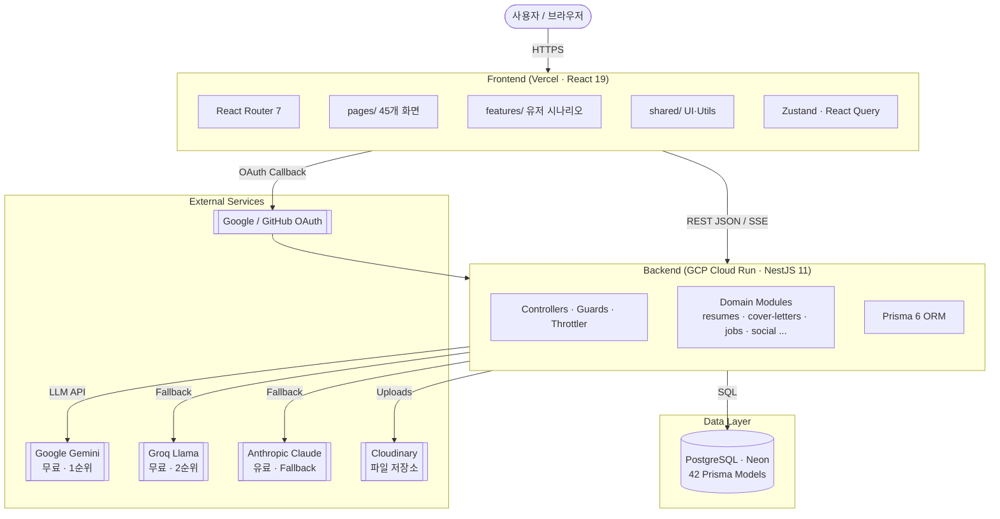

# Architecture

이력서공방(Resume Platform)은 React 19 프론트엔드와 NestJS 11 백엔드를 단일 리포지토리로 운영하는 풀스택 모놀리스입니다. 데이터 영속성은 PostgreSQL(Neon), AI 기능은 멀티 LLM 프로바이더 Fallback 체인, 파일 저장소는 Cloudinary를 사용합니다.

## 시스템 구조



## 프론트엔드 — FSD(Feature-Sliced Design) 적용 현황

Toss 스타일의 3-layer FSD 아키텍처를 점진적으로 도입하고 있습니다. 상위 레이어는 하위 레이어만 import 할 수 있으며 같은 레이어 간 cross-import는 금지합니다.

```
src/
├── app/          # 애플리케이션 진입점, 라우팅, 전역 Provider
├── pages/        # 45개 라우트 페이지 (조합 레이어)
├── features/     # 사용자 시나리오 (auth, community, notifications, recent-views)
│   └── <feature>/
│       ├── model/   # 상태·훅 (useLoginForm 등)
│       ├── api/     # feature API 호출
│       ├── ui/      # feature 전용 UI
│       └── lib/     # feature 전용 헬퍼
├── entities/     # 도메인 엔티티 (점진적 도입 중)
└── shared/       # 도메인 독립 UI·유틸·API·i18n
    ├── ui/       # ConfirmDialog 등 재사용 UI 키트
    └── lib/      # 공용 유틸 (time, cache, debounce)
```

Import 규칙: `app` → `pages` → `features` → `entities` → `shared`. `shared`는 어떤 상위 레이어도 import 하지 않습니다.

현재 레거시 `src/components/`(97개), `src/hooks/`, `src/lib/`, `src/stores/` 등이 공존하며 신규 기능부터 FSD 구조를 따릅니다. 마이그레이션 플랜은 `src/features/README.md`, `src/shared/README.md` 참조.

## 디자인 시스템 — Impeccable Design

모든 페이지는 Impeccable Design System(자체 디자인 토큰)을 사용합니다.

- 엔트리 포인트: `src/index.css`
- `:root` CSS 변수로 컬러·타이포·간격·라디우스·그림자 정의
- 대표 유틸 클래스: `.imp-card`, `.imp-button`, `.imp-input`, `.imp-section`
- 카드 상호작용: 색상 있는 테두리 대신 섬세한 shadow lift로 hover 표현
- TailwindCSS 4 유틸리티와 병행 사용. 디자인 토큰은 CSS 변수, 레이아웃은 Tailwind

최근 13개 페이지에 걸쳐 카드 스타일을 `imp-card`로 통일하였고 `ExplorePage`, `GlobalSearch`, `StatsPage` 등에도 동일 토큰이 적용되었습니다.

## 상태 관리 전략

| 유형 | 도구 | 책임 |
|------|------|------|
| 서버 상태 | **TanStack Query(React Query) 5** | API 응답 캐시, 백그라운드 재검증, 낙관적 업데이트, SSR 직렬화 |
| 글로벌 클라이언트 상태 | **Zustand 5** | 인증 세션, 편집기 드래프트, UI 토글 |
| 폼 상태 | **React Hook Form 7 + Zod 4** | 제어되지 않는 인풋, 스키마 기반 런타임 검증 |
| URL 상태 | **React Router 7** | 페이지 파라미터, 쿼리 스트링 |
| 로컬 컴포넌트 상태 | **useState / useReducer** | 일회성 상호작용 |

현재 Zustand 스토어: `useAuthStore`, `useDraftStore`, `useUIStore` (`src/stores/`). React Query 클라이언트는 `src/lib/queryClient.ts`에서 구성합니다.

## 백엔드 모듈 구성

NestJS 모듈 22개, 44개 테스트 스위트. 주요 도메인 모듈은 `server/` 하위 폴더로 1:1 매핑됩니다.

- 인증/인가: `auth/` (JWT · OAuth · Guard)
- 이력서: `resumes/`, `versions/`, `templates/`, `attachments/`, `share/`, `tags/`
- AI: `llm/` (Gemini → Groq → OpenAI Compatible → Anthropic 자동 Fallback)
- 소셜: `social/`, `comments/`, `community/`, `notifications/`
- 채용: `jobs/`, `applications/`
- 자기소개서: `cover-letters/`
- 운영: `health/`, `banners/`, `notices/`, `system-config/`, `forbidden-words/`
- 횡단 관심사: `common/` (Guards · Interceptors · Filters · Decorators)

## 데이터 & 외부 연동

- **PostgreSQL (Neon 서버리스)** — Prisma 6, 42 Models
- **Cloudinary** — 프로필 이미지·첨부파일 CDN
- **OAuth** — Google / GitHub
- **LLM Fallback Chain** — 무료 우선·rate limit 시 자동 다음 프로바이더로 전환
