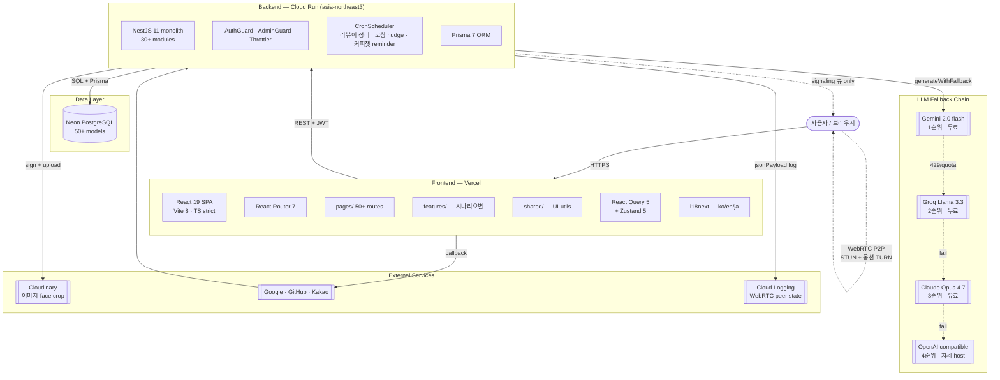
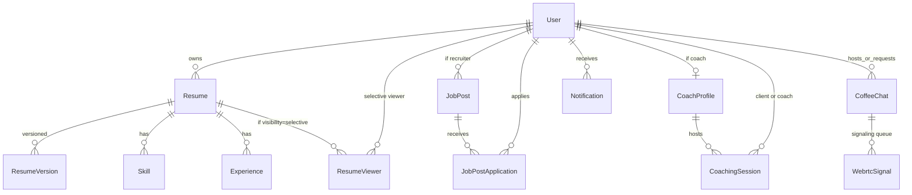

# Architecture (2026-04-27 EOD)

이력서공방(resume-platform) — 한국어 이력서·자기소개서 작성·분석·코칭 플랫폼.
React 19 SPA + NestJS 11 monorepo, Neon PostgreSQL, multi-LLM provider fallback chain.
사용자 4 유형 (구직자 / 코치 / 리쿠르터 / 기업) 동일 코드베이스에서 분기.

## 시스템 구조



## 모노레포 구조

pnpm workspaces, 3개 패키지:

```
.
├── packages/
│   ├── client/   — React + Vite SPA (Vercel 배포)
│   ├── server/   — NestJS API (Cloud Run 배포)
│   └── shared/   — 공통 zod schema, type 정의
├── prisma/       — schema.prisma + 50+ migrations (루트 유지)
├── docs/         — ARCHITECTURE.md, USER_FLOWS.md, COACHING_FLOW.md 등
└── tsconfig.*.json — strict TS 6, ignoreDeprecations 6.0
```

## 사용자 유형 (userType) 분기

```
User.userType :  personal  |  recruiter  |  company  |  coach
                 (구직자)    (헤드헌터)     (회사 hr)    (이력서 코치)
```

가입 시 LoginPage 에서 선택. 이후 페이지 navigation / 권한 / 알림 / 추천이 모두 분기:

| flow                 | personal | recruiter / company | coach              |
| -------------------- | -------- | ------------------- | ------------------ |
| 가입 후 redirect     | `/`      | `/recruiter`        | `/coach/dashboard` |
| 채용공고 등록        | ✗        | ✓                   | ✗                  |
| 코칭 세션 hosting    | ✗        | ✗                   | ✓                  |
| 인재 검색 / 스카우트 | ✗        | ✓                   | ✗                  |
| 평점 받기            | ✗        | ✗                   | ✓                  |

LoginPage `performAuth` 가 `me?.userType` 보고 dest 결정. recruiter dashboard 등은 page-level guard 로도 보호.

## 주요 도메인 모델 (Prisma)

50+ 모델, 핵심 관계:



**알림 type 카탈로그** (8 types, 2026-04-27 sweep #4 추가):

- `resume_viewed`, `resume_shared`
- `coffee_chat_request`, `coffee_chat_response`, `coffee_chat_reminder`
- `coaching_review_request`, `coaching_review_received`, `coaching_nudge`
- `job_application_received`, `job_application_stage`
- `announcement`, `follow`, `comment`, `scout`, `message`, `endorsement`, `bookmark`

## 인증 / 권한

- **JWT** — `auth/auth.service.ts`. Token 은 localStorage 저장, 매 request 에 `Authorization: Bearer` 헤더
- **OAuth** — Google / GitHub / Kakao (state HMAC + nonce, 10분 TTL)
- **Roles**: `user` | `admin` | `superadmin` (DB 컬럼)
- **userType**: `personal` | `recruiter` | `company` | `coach` (가입 시 선택, settings 에서 변경)
- **Guard**: `@UseGuards(AuthGuard)` 기본, `AdminGuard` 추가
- **Throttler**: 등록 3 req/min, 로그인 5 req/min, AI analyze 5 req/min, user search 30 req/min, job apply 10 req/min, telemetry 30 req/min

## LLM 통합

`packages/server/src/llm/` — multi-provider fallback chain. 매 호출은 비용 최소 → 풍부 순서로 시도, 429/quota 시 다음 provider.

```
generateWithFallback(systemPrompt, userMessage)
  ├─ 1. Gemini 2.0 flash      (무료, 빠름)
  ├─ 2. Groq Llama 3.3 70b    (무료, 빠름, 한국어 약함)
  ├─ 3. Claude Opus 4.7        (유료, 고품질) ← 2026-04-27 default 4.6→4.7
  ├─ 4. OpenAI compatible      (옵션, 자체 host)
  └─ 5. n8n webhook            (옵션, custom workflow)
```

**LLM 사용 영역**:

- 이력서 분석 (`/api/resumes/:id/transform/feedback`)
- JD 매칭 (`/api/resumes/:id/transform/job-match`)
- 면접 질문 생성 + 답변 분석 (`/api/interview/answers/analyze`)
- 자소서 생성, 리라이트, 한국어 톤 보정
- AI 코칭 nudge (Pro 플랜 사용자, weekly cron)
- 채용공고 URL 파싱 fallback (JSON-LD 우선, LLM 마지막)

## 한국어 분석 모듈

`packages/client/src/lib/koreanChecker.ts` — **6289줄 → 2882줄** (54% 감량) hub 모듈. 25개 서브 모듈로 분할:

- 받침/조사 처리, 한자/외래어/기술명 정규화
- ATS 호환성 검사, 정량 표현 / 1인칭 / STAR 구조 채점
- 어색한 표현 / 가짜 동사 / 불필요한 형용사 detection
- `ANALYZERS` 카탈로그에 메타데이터 등록되어 자동 발견

신규 분석기 추가 시 응집도 높은 기존 서브 모듈에 추가 → ANALYZERS 등록.

## 실시간 / 비동기

### WebRTC P2P (커피챗)

서버 비용 0 — 미디어는 brower-to-browser 직접 연결.

```
A ─┐                                  ┌─ B
   │                                  │
   ├─ STUN: stun.l.google.com ─────┤
   │                                  │
   ├─ (옵션) TURN: VITE_TURN_URL ──┤   ← env 있으면 자동 활성화
   │                                  │
   └─ Server: signaling 큐 (offer/   ─┘
        answer/ice/bye, 30초 TTL)
```

- `useWebrtcPeer` hook (`packages/client/src/lib/useWebrtcPeer.ts`)
- 1초 polling 으로 server 큐 drain (`/api/coffee-chats/signal/:roomId/poll`)
- `signal/telemetry` endpoint 로 connection state 변화 → Cloud Logging 구조화 JSON
- Mobile fallback: getUserMedia error 분류 (NotAllowed/NotFound/NotReadable) + 재시도 허용 + remote 풀폭 + local PiP

### Cron 스케줄러

`@nestjs/schedule` 6.x. 모두 cost-min:

| Cron             | 시각          | 동작                                     |
| ---------------- | ------------- | ---------------------------------------- |
| EVERY_DAY_AT_3AM | 03:00 UTC     | ResumeViewer 만료 + JobUrlCache 24h 정리 |
| EVERY_HOUR       | hourly        | CoffeeChat reminder (24h/1h 윈도우)      |
| `0 6 * * 0`      | 일요일 06 UTC | AI 코칭 nudge (Pro 사용자, max 500/주)   |
| EVERY_MINUTE     | 매 분         | WebrtcSignal stale (30초+) 정리          |

## 알림 시스템

`NotificationsService.create(userId, type, message, link?)` 단일 entry.
관련 service 가 inject 받아 fire-and-forget — `await ... .catch(() => {})` 패턴.

`createBulk(userIds, type, message, link?)` — admin 공지 발송용. 기존에 같은 type+message 받은 사용자는 idempotent skip (`Notification.findMany` + Set 기반 필터링 → `createMany skipDuplicates`).

## 공유 / 권한 모델

`Resume.visibility` enum:

| visibility  | 설명                                                |
| ----------- | --------------------------------------------------- |
| `private`   | 본인만                                              |
| `link-only` | URL 가진 사람만 (slug 또는 share link)              |
| `public`    | 검색/탐색 노출, 공개 페이지                         |
| `selective` | 화이트리스트 (`ResumeViewer` join, expires/message) |

**선택 공개 (selective)**:

- `ResumeViewer` 모델: userId + expiresAt + message + lastViewedAt + viewCount
- `addAllowedViewer` API + 자동 알림 + `ResumeViewerCleanupService` (cron)
- AllowedViewersDialog: user search autocomplete (디바운스 220ms, ↑↓ Enter 키보드 nav)
- ShareResumeWithUserDialog: targetUserId 없을 때 dialog 안에서 검색 가능

## 회사 → 지원자 pipeline (sweep #3)

`JobPostApplication` 모델:

```
구직자가 공고에 지원 (POST /api/jobs/:id/apply)
  ↓
JobPostApplication { jobId, applicantId, resumeId, coverLetter, stage }
  ↓                                                      ↑
회사 알림 (job_application_received)        recruiter 가 stage 변경
  ↓                                                      ↓
recruiter dashboard 의 pipeline view             지원자 알림 (job_application_stage)
  ↓
ApplicantDetailDrawer (이력서 lazy fetch + 자소서)
```

stage: `interested` → `contacted` → `interview` → `hired` (또는 `rejected`/`withdrawn`)

## 번들 / 배포

### Frontend (Vercel)

- Build: `pnpm --filter @resume/client build` (Vite 8)
- 환경변수: `VITE_API_URL` (Cloud Run URL), `VITE_TURN_URL/USERNAME/CREDENTIAL` (옵션)
- Headers: helmet 풍 (CSP, HSTS, X-Frame-Options DENY, Permissions-Policy)
- Rewrites: `/((?!api).*) → /index.html` (SPA fallback)

**번들 청크 분할** (sweep #9, 2026-04-27):

- `react-vendor` (230KB) — eager
- `index` (297KB), `tiptap` (394KB lazy), `charts` (437KB lazy)
- `heic` (1.3MB lazy — 모바일 사진 업로드만), `docx`, `i18n`, `image-compress` 등 분리
- vendor.js 1.5MB → 사라짐

### Backend (GCP Cloud Run)

- 서비스: `resume-api`, region `asia-northeast3`, 프로젝트 `resume-platform-prod`
- Deploy: `pnpm deploy:gcp` — `gcloud run deploy --source .`
- 환경변수: `--update-env-vars` 또는 `--env-vars-file` (절대 `--set-env-vars` 금지 — 기존 vars 덮어씀)
- 16개 env: DATABASE_URL, JWT_SECRET, GROQ/GEMINI/OPENAI keys, Cloudinary, OAuth credentials

### DB (Neon)

- 단일 PostgreSQL instance, dev/prod 공유 (cost-min)
- 50+ models, 30+ migrations, schema.prisma 루트 유지

## 보안 / privacy

- **CSP**: `default-src 'self'; script-src 'self'; img-src 'self' data: https:; connect-src 'self' https://*.run.app ...`
- **helmet**: HSTS preload, X-Frame-Options DENY, X-Content-Type-Options nosniff, Permissions-Policy (camera 차단, mic self)
- **Email masking**: user search 결과 `u***@domain` (sweep #2)
- **SSRF 차단**: JobUrlParser 가 internal IP / localhost 차단
- **Throttler**: 모든 mutation endpoint
- **이력서 ownership 검증**: 본인 resume 만 첨부/공유 가능
- **Sanitize-html**: tiptap input → sanitize → DB 저장
- **DOMPurify**: render 시 markdown/html 정리

## 테스트 전략

| 종류        | 도구                              | 위치                                    | 갯수   | 속도  |
| ----------- | --------------------------------- | --------------------------------------- | ------ | ----- |
| Server unit | Jest 30 + @swc/jest (sweep #10)   | `packages/server/src/**/*.spec.ts`      | 1368   | 2.4초 |
| Server e2e  | Jest 30 + supertest               | `packages/server/test/**/*.e2e-spec.ts` | (별도) |       |
| Client unit | Vitest 4 + @testing-library/react | `packages/client/src/**/*.test.ts(x)`   | 31     | 0.9초 |
| Type check  | `tsc -b --noEmit` (TS 6)          | 전체                                    | -      | ~30초 |

**@swc/jest**: ts-jest 가 jest 30 미지원 → swc 로 transformer 교체. 약 3배 빠른 컴파일.

## 모니터링 / 운영

- **Health**: `/api/health` — 200 OK + version + uptime + env
- **WebRTC telemetry**: `/api/coffee-chats/signal/telemetry` → Cloud Logging `event=webrtc_peer_state` JSON 로그. 1주일 누적 후 fail rate 보고 TURN 도입 ROI 결정 예정
- **Admin stats**: `/api/admin/stats` — 사용자 수, locale 분포, coffeeChat/selective/jobUrlParser/interviewAnalysis/avatars usage
- **Recruiter pipeline stats**: `/api/jobs/pipeline-stats` — funnel 전환율 + 평균 응답 시간

## 확장 포인트

| 영역      | 현재                        | 확장 옵션                        |
| --------- | --------------------------- | -------------------------------- |
| TURN 서버 | env-driven (`VITE_TURN_*`)  | Twilio NTS / Xirsys / coturn     |
| LLM       | 4 provider fallback         | n8n webhook (custom workflow)    |
| 결제      | PaymentPage (Pro 플랜 시안) | Toss / Stripe                    |
| 다국어    | ko / en / ja                | zh, vi 등 추가 (i18next 만 추가) |
| 모바일    | PWA manifest + responsive   | 별도 native (RN) 또는 capacitor  |
| 알림 채널 | in-app notification         | 이메일 / 카카오톡 / push         |

## 디자인 시스템 — Impeccable

`.impeccable.md` 가이드. neutral + sapphire/blue/cyan + 상태색 (emerald/amber/rose).
**purple 금지** — 우연히 들어가면 sweep 마다 fix.

- 토큰 entry: `packages/client/src/index.css` (`:root` CSS 변수)
- 카드: `imp-card` (subtle shadow lift, 색 border 금지)
- 버튼: `imp-btn`, `btn-shine`
- stagger reveal, marquee divider, heading-accent 등 기존 utilities 재사용

## 진화 history (sweep log)

`docs/USER_FLOWS.md` — 7 sweeps (28+ 영역) 누적 audit + fix 기록.
주요 model 추가: `JobPostApplication` (sweep #3), `InterviewAnswer` 확장 (sweep #2).
주요 endpoint 추가: 15개 (sweeps #2~#5).

---

작성일: 2026-04-27 EOD · 다음 갱신: TURN 도입 결정 시점 (2026-05-04+) 또는 신규 도메인 추가 시
